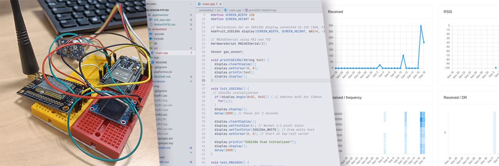
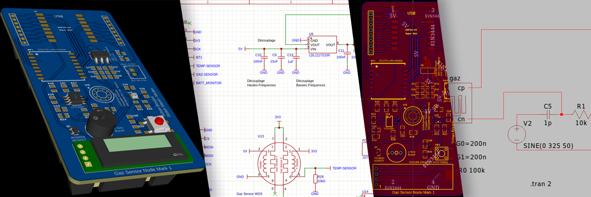
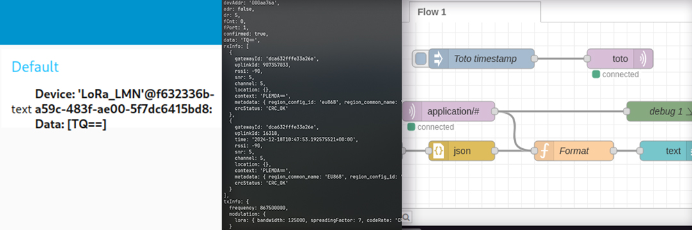

# UF Smart Devices

## Embedded

[Full Software design here](hardware)

We made a breadboard using various components like a *LoRa UART* [RN2483A](https://ww1.microchip.com/downloads/aemDocuments/documents/OTH/ProductDocuments/DataSheets/RN2483-Low-Power-Long-Range-LoRa-Technology-Transceiver-Module-DS50002346F.pdf), an [SSD1306](https://cdn-shop.adafruit.com/datasheets/SSD1306.pdf) I2C Screen and a [Gaz Sensor MQ5](https://wiki.seeedstudio.com/Grove-Gas_Sensor-MQ5/) from Seeed Studio. The goal would be to communicate using the LoRa chip to [ChirpStack](https://www.chirpstack.io/) by sending the sensor data directly to the gateway. We decided to use an ESP32 for this project, because it has a wide variety of pins that can be dynamic allocated on each gpio. Plus, espidf is a framework we are familiar with.

## Hardware

[Full LTSpice simulation and EasyEDA design here](hardware)

The goal in this part would be to create a fully working PCB with everything we designed so far. Our own gaz sensor will be used. The first step would be to emulate on **LTSpice** the behavior of such a sensor. With this we can then design a board with the correct schematic on **EasyEDA**.

## Node Red

[Full Node-Red setup here](node-red)

We would need to create a node-red flow to actually gather the data and show it on a dashboard. To do this we would have to connect using a MQTT Broker, Chirpstack has the ability to resend, via a given topic the data gathered by the device.

## App Inventor

Using the [AppInventor](https://ai2.appinventor.mit.edu/) we have designed a mobile application that can directly communicate with a bluetooth receiver and power on a LED. You can see the application from the files as well as the source file for the embedded part.